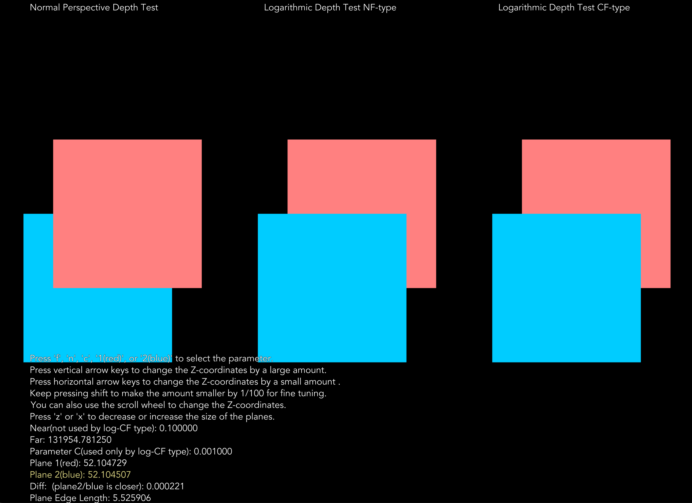

# ZFightingTools
Tools to visualize and experiment with the Z-Fighting problem in OpenGL

<a href="doc/banner1.png"></a>

<a href="doc/banner2.png"></a>

# Overview
This repository contains three tools that accompany the blog post on Medium:

[https://medium.com/@e92rodbearings/practical-analysis-on-the-z-fighting-and-the-logarithmic-depth-tests-for-computer-graphics-43509504e065](https://medium.com/@e92rodbearings/practical-analysis-on-the-z-fighting-and-the-logarithmic-depth-tests-for-computer-graphics-43509504e065)

* `depth_test_interactive`: interactively visualizes the effect of Z-fighting with three different types of depth tests.

* `depth_test_shader_comparator`: interactively visualizes the geometric distortion caused by the logarithmic depth set to gl_Position in the vertex shader.

* `depth_test_batch`: command-line batch test tool to test the minimum gap for each sampled point in VCS by a combination of the grid search and the binary sesarch.

It also contains some python scripts under [python/](python/) to generate the charts with matplotlib.
The main script is [python/plot_depth.py](python/plot_depth.py).

# Supported Environments

* Linux

* macOS (tested on Mac mini M1 2020 & Ventura 13.5.2)

# Reuirements

* [OpenGL](https://www.opengl.org)
* [LibPNG](http://www.libpng.org/pub/png/libpng.html) : used to load the font texture file in png.
* [GLEW](https://glew.sourceforge.net) : a quasi requirement to load OpenGL.
* [GLFW3](https://www.glfw.org) : a window manager for OpenGL used in the demo program.

Following is a sample installation process tested on Ubuntu 22.04.3 LTS.
```
sudo add-apt-repository universe
sudo add-apt-repository multiverse
sudo apt update
# The following three lines are apparently needed to make 'sudo apt-get build-dep' work.
# Ref: https://askubuntu.com/questions/496549/error-you-must-put-some-source-uris-in-your-sources-list
cat /etc/apt/sources.list | grep deb-src
sudo sed -i~orig -e 's/# deb-src/deb-src/' /etc/apt/sources.list
sudo apt-get update

sudo apt install build-essential
sudo apt install cmake
sudo apt-get build-dep libglfw3
sudo apt-get build-dep libglew-dev
sudo apt install libglew-dev
sudo apt install libglm-dev
sudo apt install libglfw3
sudo apt install libglfw3-dev
sudo apt install libpng-dev
```

## Installing GLFW on MacOS.
On MacOS the requirements can be installed by [Homebrew](https://brew.sh).
However, the GLFW installed by Homebrew does not seem to work for me and I had to manually build it.
(The **glfwCreateWindow()** returns **nullptr** when it is linked with Homebrew's glfw library.)

```
$ git clone https://github.com/glfw/glfw.git
$ cd glfw
$ mkdir build
$ cd build
$ cmake -DCMAKE_BUILD_TYPE=Release .. 2>&1 | tee cmake_console_out.txt
$ VERBOSE=1 make 2>&1 | tee make.log
$ VERBOSE=1 sudo make install 2>&1 | tee make_install.log
```

# Build & Run
The tools can be built with the standard CMake process.

```
$ cd <path/to>/ZFightingTools
$ mkdir build
$ cd build
$ cmake -DCMAKE_BUILD_TYPE=Release ..
$ VERBOSE=1 make
```
This will build the following tools.

* `depth_test_interactive`
* `depth_test_shader_comparator`
* `depth_test_batch`

To run them, simply invoke them in your shell.
Do not move the binaries to other locations, as they depend on the files stored in <path/to>/ZFightingTools/data, which are specified by relative paths.

# License
GPLv3

# Contact
Shoichiro Yamanishi

e92rodbearings @ gmail . com
